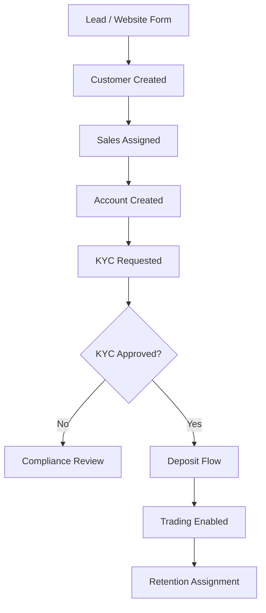
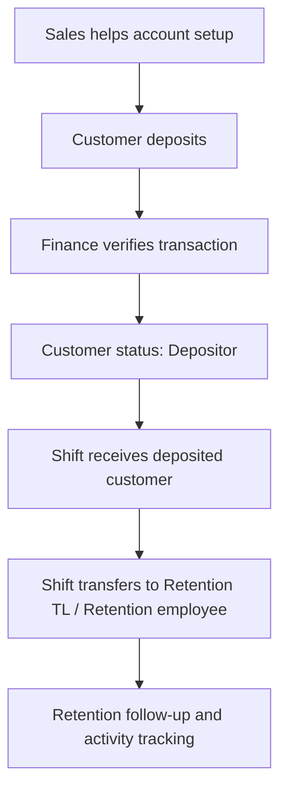
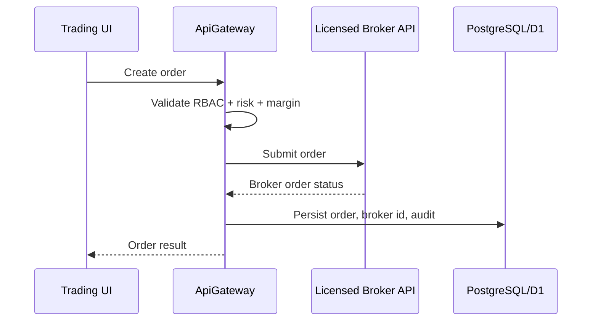
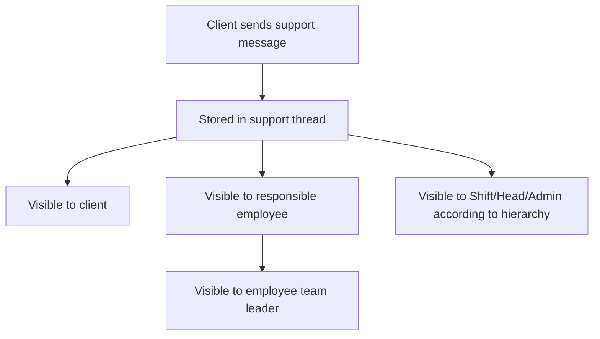

# ALS Yatırım Enterprise SRS

## 1. Purpose

This Software Requirement Specification defines the target enterprise platform for ALS Yatırım:

- Multi-brand investment CRM
- Customer portal
- CRM panel
- Super admin panel
- Broker-connected trading operations
- KYC / AML / compliance
- Campaigns, affiliates, tickets, finance, reporting
- AI-assisted sales, retention, risk, support and campaign operations

This document is the source of truth for product scope, roles, modules, flows and non-functional requirements.

## 2. Business Goals

| Goal | Description |
|------|-------------|
| Multi-brand operations | Run multiple investment brands from one control plane. |
| Customer lifecycle | Manage leads, onboarding, KYC, deposits, trading activity and retention. |
| Role-based operations | Separate Admin, Shift, Head, Team Leader, Sales, Retention, Finance, Support, Compliance and Client access. |
| Broker-ready trading | Route real orders to licensed broker APIs after production credentials are configured. |
| Compliance-first | Keep KYC, AML, audit, device, session and activity records. |
| Reporting | Provide operational, finance, conversion, campaign and employee performance reports. |
| Scalability | Prepare the architecture for microservices, PostgreSQL, Redis, ElasticSearch and RabbitMQ. |

## 3. User Roles

| Role | Purpose |
|------|---------|
| SuperAdmin | Owns all brands, databases, APIs, homepage builder, CMS, system settings and monitoring. |
| Admin | Platform operator who creates and manages Shift companies. Does not need to see client rows by default. |
| Shift | Represents a company/brand/operator group. Manages Head and all lower roles within that company. |
| HeadShift / Head | Manages Sales TL, Retention TL, Sales, Retention and Clients inside a Shift company. |
| Sales TL | Manages Sales employees and sales client pipeline. |
| Retention TL | Manages Retention employees and retained/depositor client pipeline. |
| Sales | Creates/helps onboard clients, supports account creation and deposit flow. |
| Retention | Handles deposited/active clients transferred from Sales/Shift. |
| Support | Handles support messages, ticket messages and customer issues. |
| Finance | Handles deposits, withdrawals, bonuses, commissions and wallet accounting. |
| Compliance | Handles KYC, AML, verification and customer risk reviews. |
| Affiliate / Partner | Tracks referrals, clicks, revenue and commissions. |
| Client | Customer. Can access customer portal, trading area, wallet, KYC, support and profile. Cannot view other users/roles. |

## 4. Permission Matrix

| Permission | SuperAdmin | Admin | Shift | Head | Sales TL | Retention TL | Sales | Retention | Support | Finance | Compliance | Client |
|------------|------------|-------|-------|------|----------|--------------|-------|-----------|---------|---------|------------|--------|
| customer_view | Yes | No by default | Scoped | Scoped | Scoped | Scoped | Own/assigned | Own/assigned | Assigned | Read | Read | Self |
| customer_edit | Yes | No by default | Scoped | Scoped | Scoped | Scoped | Assigned | Assigned | No | Finance fields | Compliance fields | Self limited |
| customer_comment | Yes | No by default | Scoped | Scoped | Scoped | Scoped | Assigned | Assigned | Assigned | No | No | No |
| ticket_create | Yes | Yes | Yes | Yes | Yes | Yes | Yes | Yes | Yes | No | No | Yes |
| ticket_close | Yes | Yes | Yes | Yes | Yes | Yes | No | No | Yes | No | No | No |
| campaign_create | Yes | No | Yes | Yes | No | No | No | No | No | No | No | No |
| homepage_create | Yes | No | No | No | No | No | No | No | No | No | No | No |
| employee_create | Yes | Shift only | Scoped | Scoped | Scoped lower | Scoped lower | No | No | No | No | No | No |
| finance_access | Yes | Yes | Yes | Yes | No | No | No | No | No | Yes | Read | Self |
| database_access | Yes | No | No | No | No | No | No | No | No | No | No | No |
| trading_access | Yes | Yes | Scoped | Scoped | Scoped | Scoped | Assigned | Assigned | No | Read | Read | Self |
| trading_order | Broker-controlled | Broker-controlled | Scoped | Scoped | Scoped | Scoped | Assigned | Assigned | No | No | No | Self if enabled |
| kyc_review | Yes | Yes | Yes | Yes | No | No | No | No | No | No | Yes | No |
| aml_review | Yes | Yes | Yes | Yes | No | No | No | No | No | No | Yes | No |
| monitoring_access | Yes | No | No | No | No | No | No | No | No | No | No | No |

## 5. Product Modules

### 5.1 Website

Public marketing website with:

- Home
- Forex
- Stocks
- Commodities
- Indices
- Crypto
- News
- Economic Calendar
- Blog
- Contact
- Risk Disclosure
- Corporate

### 5.2 Customer Portal

Client-facing area:

- Dashboard
- Profile
- Wallet
- Deposit
- Withdraw
- Transactions
- KYC
- Notifications
- Support
- Trading terminal

### 5.3 CRM Panel

Employee-facing area:

- Dashboard
- Customers
- Customer Detail
- Employees
- Roles
- Campaigns
- Tickets
- Reports
- Finance
- Notifications
- Trading terminal

### 5.4 Super Admin Panel

System control area:

- Brands
- Homepage Builder
- CMS
- APIs
- Databases
- Settings
- Monitoring
- Audit
- Feature flags

## 6. Core Workflows

### 6.1 Customer Onboarding

### 6.2 Deposit and Retention Transfer

### 6.3 Live Broker Order

### 6.4 Support Messaging Visibility

## 7. Use Cases

### UC-001: SuperAdmin creates a brand

- Actor: SuperAdmin
- Preconditions: SuperAdmin authenticated and has `brand_create`.
- Flow:
  1. Opens Super Admin / Brands.
  2. Enters brand metadata, domain, theme and database settings.
  3. Saves brand.
  4. System provisions brand config and audit log.
- Postcondition: Brand is available for website and CRM routing.

### UC-002: Admin creates Shift company

- Actor: Admin
- Preconditions: Admin has `employee_create`.
- Flow:
  1. Opens Shift Management.
  2. Creates Shift user and company name.
  3. System creates Shift account.
- Postcondition: Shift can create/manage Head and lower roles.

### UC-003: Sales creates customer

- Actor: Sales
- Preconditions: Sales has `customer_create`.
- Flow:
  1. Opens Customers.
  2. Creates customer.
  3. Helps account creation and deposit flow.
- Postcondition: Customer is assigned to Sales and appears in scoped list.

### UC-004: Retention receives customer

- Actor: Shift / Retention TL
- Preconditions: Customer deposited.
- Flow:
  1. Shift opens deposited customers.
  2. Transfers customer to Retention employee or Retention TL.
  3. Retention follows status and comments.
- Postcondition: Customer appears in Retention queue.

### UC-005: Client opens support message

- Actor: Client
- Preconditions: Client authenticated.
- Flow:
  1. Opens Support.
  2. Sends message.
  3. Responsible employee and TL can view/reply.
- Postcondition: Support thread contains message and audit trail.

## 8. Functional Requirements

### Authentication

- FR-AUTH-001: Users shall authenticate via email/password.
- FR-AUTH-002: System shall support JWT with refresh token strategy in the target architecture.
- FR-AUTH-003: System shall support 2FA via Google Authenticator.
- FR-AUTH-004: System shall track sessions and devices.
- FR-AUTH-005: System shall allow session revocation.

### RBAC

- FR-RBAC-001: All protected APIs shall check permissions server-side.
- FR-RBAC-002: UI shall hide actions the user cannot perform.
- FR-RBAC-003: Client shall never see other users or roles.
- FR-RBAC-004: Shift shall only manage its own hierarchy.
- FR-RBAC-005: SuperAdmin shall manage all brands and platform settings.

### Customers

- FR-CUST-001: System shall create customers with numeric customer ID.
- FR-CUST-002: System shall store contact, personal, source, status and assignment data.
- FR-CUST-003: System shall allow comments and extra info.
- FR-CUST-004: System shall show Sale status or Retention status based on assigned employee role.
- FR-CUST-005: System shall support customer timeline.

### Trading

- FR-TRD-001: Trading orders shall require broker configuration.
- FR-TRD-002: System shall not create fake fills in live mode.
- FR-TRD-003: Broker order id and response message shall be stored.
- FR-TRD-004: Trading terminal shall show symbols, order book, positions, P/L, margin and order history.
- FR-TRD-005: Real order flow shall be broker-adapter based.

### Finance

- FR-FIN-001: System shall track deposits, withdrawals, bonuses, commissions, swaps and transfers.
- FR-FIN-002: Finance transactions shall include status and reference number.
- FR-FIN-003: Customer list shall show deposited amount and total balance.

### KYC / AML

- FR-KYC-001: System shall store document records.
- FR-KYC-002: System shall support passport, ID card, address verification and face verification.
- FR-AML-001: System shall support AML check records and compliance review.

### Multi Brand

- FR-MB-001: Each brand shall have separate config.
- FR-MB-002: Target architecture shall support separate database per brand.
- FR-MB-003: Each brand shall have separate theme, homepage, blog, SEO and campaigns.

### Homepage Builder

- FR-HB-001: SuperAdmin can create unlimited homepages.
- FR-HB-002: Homepages are block-based.
- FR-HB-003: Supported blocks: hero, slider, market widget, news widget, blog widget, CTA, footer and header.

### AI

- FR-AI-001: System shall support AI lead scoring.
- FR-AI-002: System shall support AI customer analysis.
- FR-AI-003: System shall support AI risk engine.
- FR-AI-004: System shall support AI CRM assistant.
- FR-AI-005: System shall support AI campaign optimization and ticket assistant.

## 9. Non-Functional Requirements

| Category | Requirement |
|----------|-------------|
| Security | OWASP ASVS-aligned API validation, authz, audit and rate limiting. |
| Availability | Target 99.9% for production services after cloud deployment. |
| Performance | P95 API response under 300ms for common CRM reads, excluding external broker calls. |
| Scalability | Service boundaries must allow split into .NET 9 microservices. |
| Observability | Structured logs, metrics, traces, alerting and audit trails. |
| Compliance | KVKK/GDPR export and erasure flows; KYC/AML record retention. |
| Data integrity | ACID writes for money and trade records; idempotent broker callbacks. |
| Resilience | Broker API failures must not corrupt local records. |
| Localization | Date/time must follow employee timezone and brand locale. |
| Maintainability | Clean Architecture, DDD, CQRS and repository boundaries in target backend. |

## 10. Acceptance Criteria

- Admin can only manage Shift companies.
- Shift can manage hierarchy under its company.
- Client cannot access admin/permission screens.
- Customer detail modules work by tabs.
- Trading order creation requires broker credentials.
- Broker response is persisted.
- Customer support visibility follows responsible employee and team leader rules.
- Timezone-aware date/time fields work by employee country/timezone.
- SuperAdmin can manage brands and homepage builder in target architecture.
