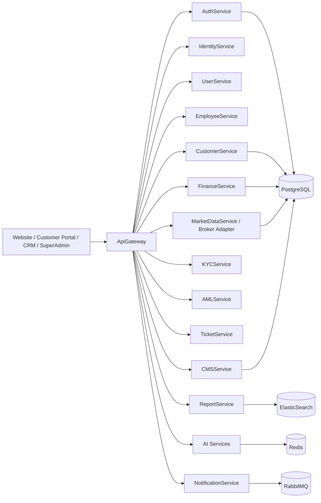
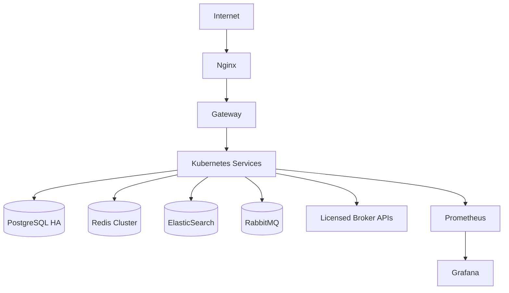

# ALS Yatırım Microservice Architecture

## 1. Target Architecture

The enterprise target is a .NET 9 microservice platform with a Next.js 15 frontend suite.



## 2. Technology Baseline

| Layer | Technology |
|-------|------------|
| Backend | .NET 9 |
| Architecture | Clean Architecture, DDD, CQRS |
| Mediator | MediatR |
| Validation | FluentValidation |
| Mapping | AutoMapper |
| Persistence | Repository Pattern, Unit Of Work |
| Logs | Serilog |
| Database | PostgreSQL |
| Cache | Redis |
| Search | ElasticSearch |
| Messaging | RabbitMQ |
| Frontend | Next.js 15, TypeScript, TailwindCSS, shadcn/ui |
| CRM UI | React, Material UI, AG Grid |
| State | TanStack Query, Zustand |
| DevOps | Docker, Docker Compose, Kubernetes, Helm, Nginx |
| Observability | Prometheus, Grafana |
| CI/CD | GitHub Actions |

## 3. Service Catalogue

### 3.1 ApiGateway

- Routes external requests to internal services.
- Handles auth token extraction, request correlation, rate-limit headers.
- Performs coarse-grained route authorization.

### 3.2 AuthService

- Login, logout, token issue, token refresh.
- Password reset.
- 2FA verification.
- Device/session revocation.

### 3.3 IdentityService

- User identities.
- OAuth accounts.
- Credentials metadata.
- User locale/timezone.

### 3.4 UserService

- Shared user profile operations.
- Customer/employee profile bridge.
- Personal data export/erasure orchestration.

### 3.5 EmployeeService

- Employees.
- Shift/company hierarchy.
- Head/TL/Sales/Retention assignments.
- Employee targets and performance.

### 3.6 CustomerService

- Customer records.
- Customer detail, comments, timeline.
- Status pipelines.
- Assignment and transfer flows.
- Customer tags and sources.

### 3.7 RoleService

- Role catalog.
- Role hierarchy.
- Role lifecycle.

### 3.8 PermissionService

- Permission catalog.
- Role-permission assignments.
- Scoped permissions.
- Policy evaluation support.

### 3.9 HomepageService

- Homepage builder.
- Page/block composition.
- Brand homepage assignment.

### 3.10 BrandService

- Brand definitions.
- Domains.
- Themes.
- Feature flags.
- Brand database settings.

### 3.11 CMSService

- Blog.
- News.
- Media assets.
- Menus.
- SEO metadata.

### 3.12 FinanceService

- Deposits.
- Withdrawals.
- Finance approvals.
- Bonuses.
- Commissions.
- Ledger entries.

### 3.13 WalletService

- Wallet creation.
- Wallet balances.
- Currency conversion.
- Balance snapshots.

### 3.14 TicketService

- Tickets.
- Ticket messages.
- Attachments.
- Support assignment.

### 3.15 NotificationService

- Email.
- SMS.
- Push.
- In-app notifications.
- Webhooks.

### 3.16 CampaignService

- Campaigns.
- Targeting.
- Campaign execution.
- Conversion tracking.

### 3.17 AuditService

- Immutable audit log writes.
- Activity logs.
- Security events.
- Compliance export.

### 3.18 MarketDataService

- Quotes.
- Order books.
- Symbols.
- Economic calendar.
- Provider adapters: TradingView, Finnhub, Polygon, AlphaVantage, Binance, BIST.

### 3.19 BrokerService

- Licensed broker API adapter.
- Order submit/cancel/modify.
- Broker callbacks.
- Execution reports.

### 3.20 KYCService

- Document upload metadata.
- Verification workflow.
- Face verification.
- Address verification.
- Compliance review queue.

### 3.21 AMLService

- AML provider integration.
- Watchlist screening.
- AML risk scoring.
- Review records.

### 3.22 AffiliateService

- Referral links.
- Partners.
- Click tracking.
- Revenue tracking.
- Commission calculation.

### 3.23 ReportService

- CRM reports.
- Finance reports.
- Trading reports.
- Employee performance.
- Campaign reports.

### 3.24 AI Services

- AI Lead Scoring Service.
- AI Customer Analysis Service.
- AI Risk Engine Service.
- AI CRM Assistant Service.
- AI Campaign Optimization Service.
- AI Ticket Assistant Service.

## 4. Service Boundaries

| Domain | Owns data | Publishes events |
|--------|-----------|------------------|
| Auth | sessions, refresh tokens, devices | UserLoggedIn, SessionRevoked |
| Customer | customers, comments, timeline | CustomerCreated, CustomerStatusChanged |
| Employee | employees, hierarchy | EmployeeAssigned, ShiftCreated |
| Finance | wallets, deposits, withdrawals | DepositApproved, WithdrawalRequested |
| Trading | orders, positions, executions | OrderSubmitted, OrderFilled, MarginAlert |
| KYC | documents, verification | KycApproved, KycRejected |
| AML | checks, watchlist hits | AmlHitCreated, AmlCleared |
| Campaign | campaigns, targets | CampaignStarted, CampaignConverted |
| Ticket | tickets, messages | TicketCreated, TicketClosed |
| Notification | messages, templates | NotificationSent |

## 5. Event Contracts

### CustomerCreated

```json
{
  "eventId": "uuid",
  "brandId": "uuid",
  "customerId": "uuid",
  "source": "google_ads",
  "createdAt": "2026-06-20T00:00:00Z"
}
```

### DepositApproved

```json
{
  "eventId": "uuid",
  "brandId": "uuid",
  "customerId": "uuid",
  "amount": 1000.00,
  "currency": "USD",
  "approvedAt": "2026-06-20T00:00:00Z"
}
```

### OrderSubmitted

```json
{
  "eventId": "uuid",
  "brandId": "uuid",
  "customerId": "uuid",
  "brokerOrderId": "string",
  "symbol": "EURUSD",
  "side": "buy",
  "quantity": 1.0,
  "submittedAt": "2026-06-20T00:00:00Z"
}
```

## 6. Deployment Topology



## 7. Clean Architecture per Service

Each .NET service should use:

```text
ServiceName.Api
ServiceName.Application
ServiceName.Domain
ServiceName.Infrastructure
ServiceName.Contracts
ServiceName.Tests
```

### Dependency rule

```text
Api -> Application -> Domain
Infrastructure -> Application + Domain
Contracts -> shared DTO/events
```

## 8. CQRS Pattern

Examples:

- `CreateCustomerCommand`
- `AssignCustomerToEmployeeCommand`
- `ApproveDepositCommand`
- `SubmitBrokerOrderCommand`
- `GetCustomerDetailQuery`
- `GetTradingPositionsQuery`

## 9. Security Architecture

- JWT access tokens.
- Rotating refresh tokens.
- 2FA TOTP.
- IP whitelist.
- Device tracking.
- Session revocation.
- Rate limiting at Gateway and service level.
- Audit logging for all sensitive actions.
- Secrets stored in Kubernetes secrets / cloud secret manager.
- Cloudflare WAF and DDoS protection in front.

## 10. Observability

- Correlation ID per request.
- Serilog structured logs.
- OpenTelemetry traces.
- Prometheus metrics.
- Grafana dashboards.
- Alert rules for:
  - Broker API failures
  - Deposit/withdraw stuck state
  - KYC backlog
  - Login attack
  - Queue lag
  - API p95 latency

## 11. Migration From Current MVP

| Current Next/D1 module | Target service |
|------------------------|----------------|
| Auth.js route handlers | AuthService / IdentityService |
| users service | UserService / EmployeeService / CustomerService |
| client-detail service | CustomerService |
| trading service | TradingService / BrokerService / MarketDataService |
| crm-overview service | ReportService |
| audit helpers | AuditService |
| notifications | NotificationService |
| marketing pages | HomepageService / CMSService |

## 12. Environments

| Environment | Purpose |
|-------------|---------|
| local | Developer local stack via Docker Compose |
| dev | Shared development |
| staging | Pre-production, broker sandbox |
| production | Real customers and real broker credentials |

## 13. Broker Integration Rules

- Never create local fake fills in production.
- All live orders must go through BrokerService.
- Broker callbacks are idempotent.
- Store request/response payload hashes.
- Reject order if customer KYC/trading permission is not active.
- Reject order if margin/risk rules fail.

## 14. Future Modules

- Copy Trading
- PAMM
- MAM
- Social Trading
- AI Trading Assistant
- iOS App
- Android App
